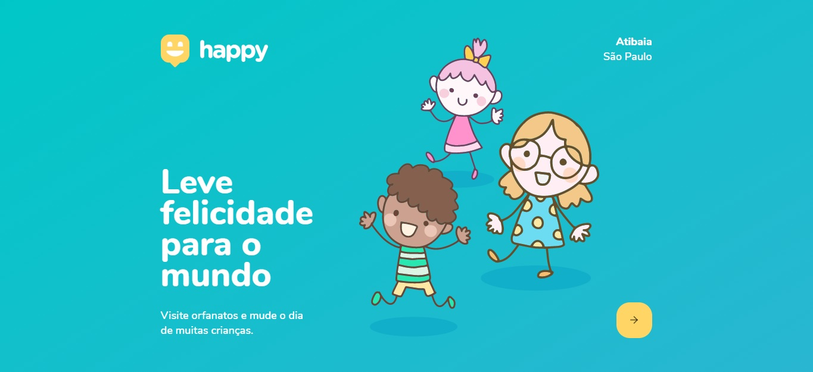

# Next Level Week - Rocketseat


Happy é uma aplicação social para o cadastro e localização de orfanatos em sua cidade.

## Aplicações

### HappyBackEnd é nossa API, para executa-la faça:

```bash
npm install
```

```bash
npm run dev
```

### HappyMobile é nossa aplicativo mobile, para roda-lo e testa-lo:

Instale o Client Expo em seu smartphone:

[Android](https://play.google.com/store/apps/details?id=host.exp.exponent)

[iOS](https://apps.apple.com/br/app/expo-client/id982107779)


```bash
npm install expo-cli -g
```

```bash
npm install
```

```bash
expo start
```

Escanear o QR usando o Client do Expo.

### Happy é nossa aplicação WEB, para executa-la faça:

```bash
npm install
```

```bash
npm start
```

## Agradecimentos

Meus mais sinceros agradecimentos a toda a equipe da Rocketseat que ministraram com excelencia toda a Next Level Week.

## License
[MIT](https://choosealicense.com/licenses/mit/)
